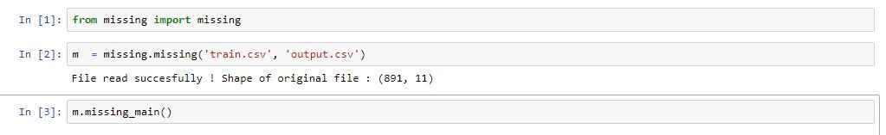
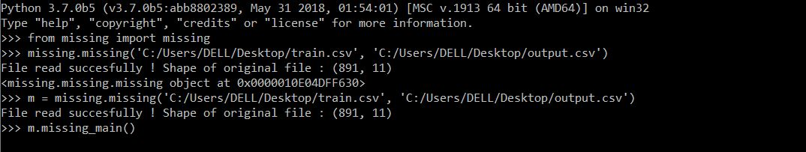
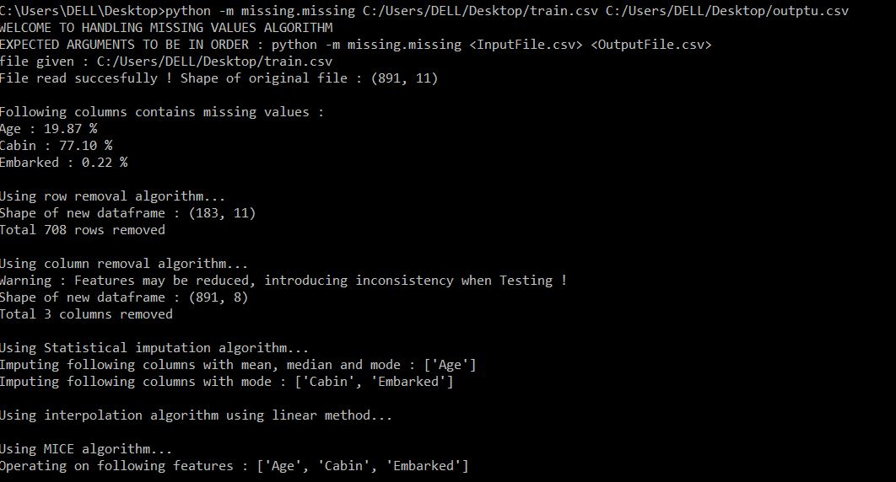
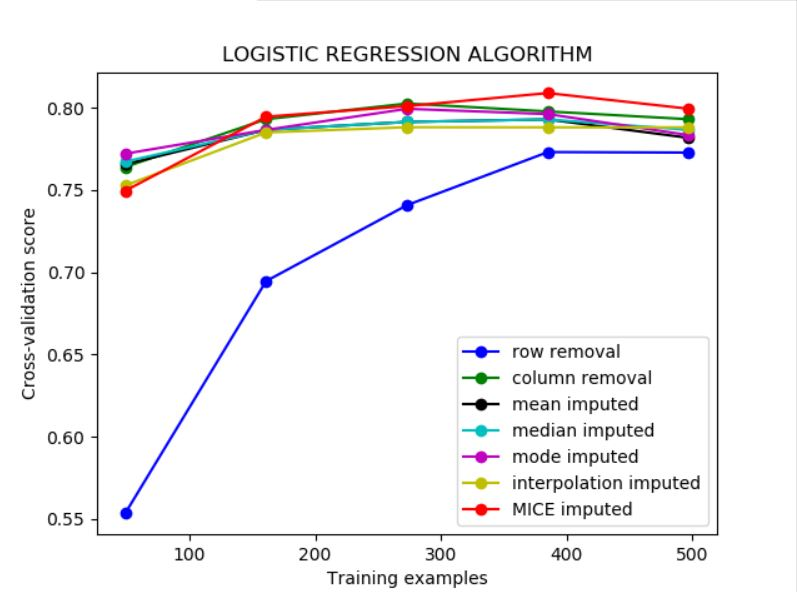
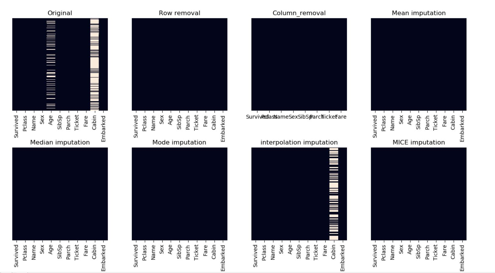

# handle-missing-values    

# Package Description :
Python package for Detecting and Handling missing values by visualizing and applying different algorithms.
# Motivation :   
This is a part of project - III made for UCS633 - Data analytics and visualization at TIET.     
@Author : Sourav Kumar    
@Roll no. : 101883068    
# Knowledge of missing values : 
Before handling, we have to sometimes watch out for the reason behind the missing values.   
There are various reasons - 
* Missingness completely at random   
* Missingness at random  
* Missingness that depends on unobserved predictors 
* Missingness that depends on the missing value itself     

# Algorithm :       
* **Row removal** / **Column removal** : It removes rows or columns (based on arguments) with missing values / NaN.   
Python's pandas library provides a function to remove rows or columns from a dataframe which contain missing values or NaN.   
It will remove all the rows which had any missing value. It will not modify the original dataframe, it just returns a copy with modified contents.   
Default value of 'how' argument in dropna() is 'any' & for 'axis' argument it is 0. It means if we don't pass any argument in dropna() then still it will delete all the rows with any NaN.      
* **Statistical Imputation** : 
**Mean imputation** : Another imputation technique involves replacing any missing value with the mean of that variable for all other cases, which has the benefit of not changing the sample mean for that variable. However, mean imputation attenuates any correlations involving the variable(s) that are imputed.    
**Median imputation** : Similar to mean, median is used to impute the missing values, useful for numerical features.   
**Mode imputation** : Most Frequent is another statistical strategy to impute missing values and YES!! It works with categorical features (strings or numerical representations) by replacing missing data with the most frequent values within each column.    

* **Interpolation imputation** : It tries to estimate values from other observations within the range of a discrete set of known data points.   
This method works well for a time series with some trend but is not suitable for seasonal data.   
* **MICE imputation** : This is the one of the most efficient methods which has three steps :    
-> Imputation – Similar to single imputation, missing values are imputed. However, the imputed values are drawn m times from a distribution rather than just once. At the end of this step, there should be m completed datasets.   
-> Analysis – Each of the m datasets is analyzed. At the end of this step there should be m analyses.    
-> Pooling – The m results are consolidated into one result by calculating the mean, variance, and confidence interval of the variable of concern.      
Multivariate imputation by chained equations (MICE), sometimes called 'fully conditional specification' or 'sequential regression multiple imputation' has emerged in the statistical literature as one principled method of addressing missing data. Creating multiple imputations, as opposed to single imputations, accounts for the statistical uncertainty in the imputations.   
* **Random Forests imputation** : They have the desirable properties of being able to handle mixed types of missing data, they are adaptive to interactions and nonlinearity, and they have the potential to scale to big data settings.   
* **KNN imputation** : KNN is an algorithm that is useful for matching a point with its closest k neighbors in a multi-dimensional space. It can be used for data that are continuous, discrete, ordinal and categorical which makes it particularly useful for dealing with all kind of missing data.    
The assumption behind using KNN for missing values is that a point value can be approximated by the values of the points that are closest to it, based on other variables.   

* Other Methods using Deep learning can be build to predict the missing values.   

### Getting started Locally :  
> Run On Terminal       
```python -m missing.missing <inputFilePath> <outputFilePath>```     
ex. python -m missing.missing C:/Users/DELL/Desktop/train.csv C:/Users/DELL/Desktop/output.csv        

> Run In IDLE   
```from missing import missing```   
```m = missing.missing(inputFilePath, outputFilePath)```     
```m.missing_main()```      

> Run on Jupyter   
Open terminal (cmd)   
```jupyter notebook```   
Create a new python3 file.     
```from missing import missing```   
```m = missing.missing(inputFilePath, outputFilePath)```     
```m.missing_main()```     

* NOTE : Please make sure that you have ```[statsmodels](https://www.statsmodels.org/stable/install.html)``` installed which is used in one of the algorithms for multiple imputations.  
### OUTPUT :
After analysing and visualizing every possible algorithm against metrics (accuracy, log_loss, recall, precision), The best algorithm is applied for imputing the missing values in the original dataset.    
Also , the final dataframe will be written to the output file path you provided.
 


   

  


# TESTING : 
* The package has been extensively tested on various datasets consisting varied types of expected and unexpected input data and any preprocessing , if required has been taken care of.

